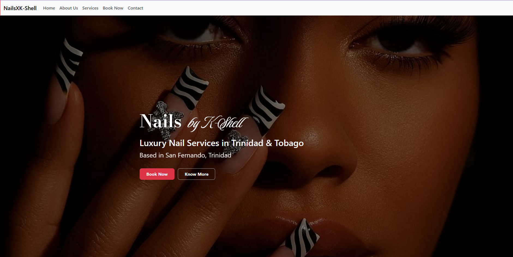
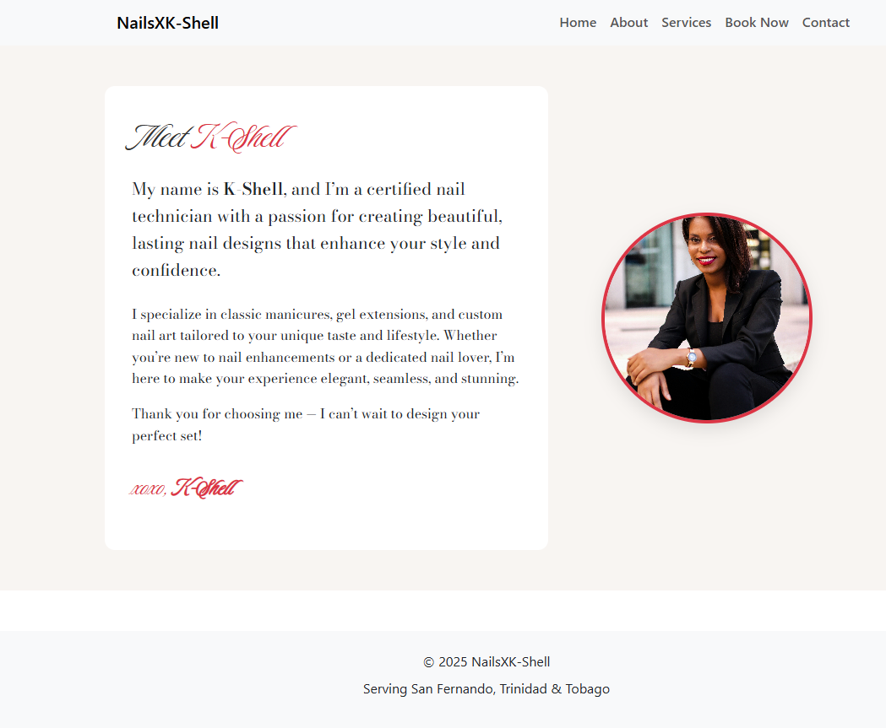
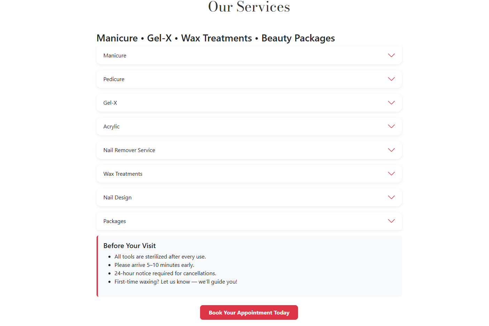
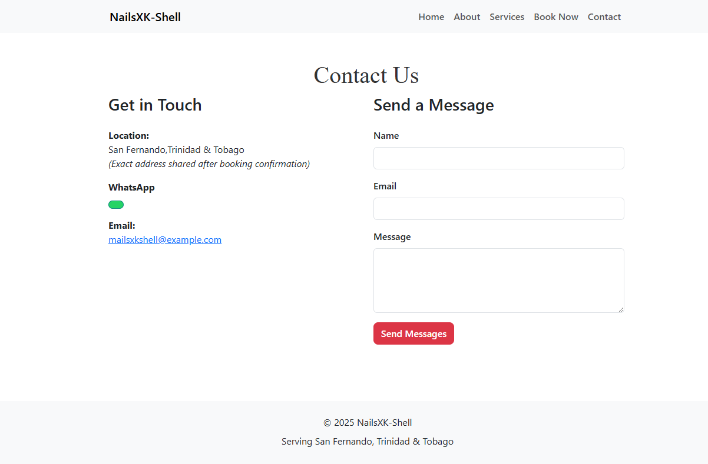
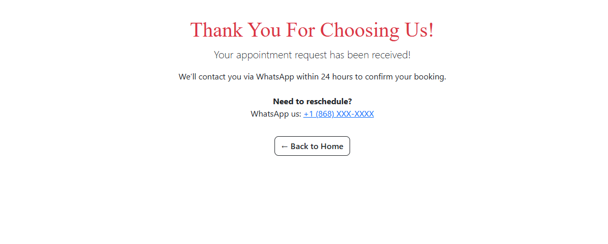
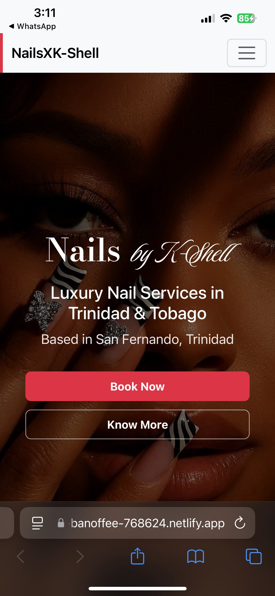
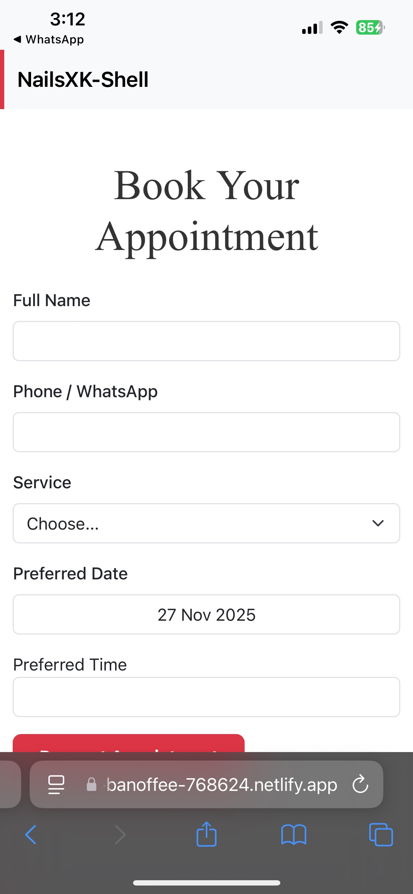
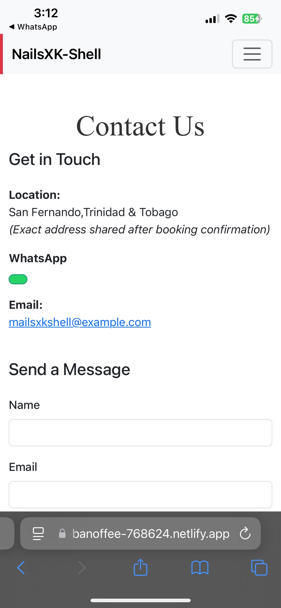
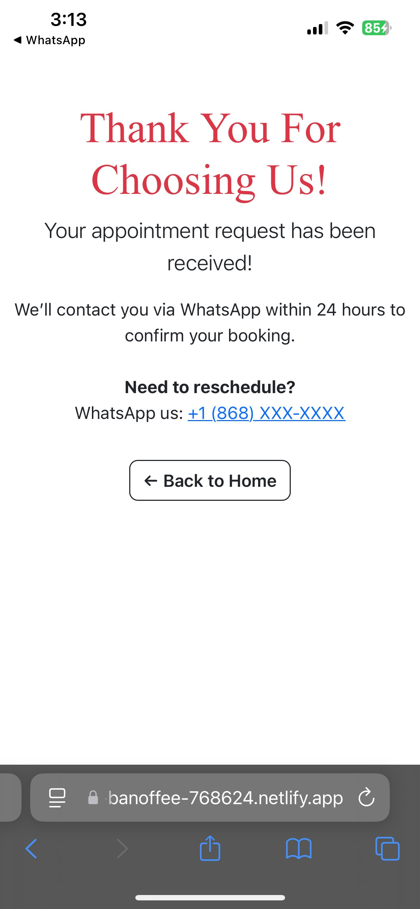
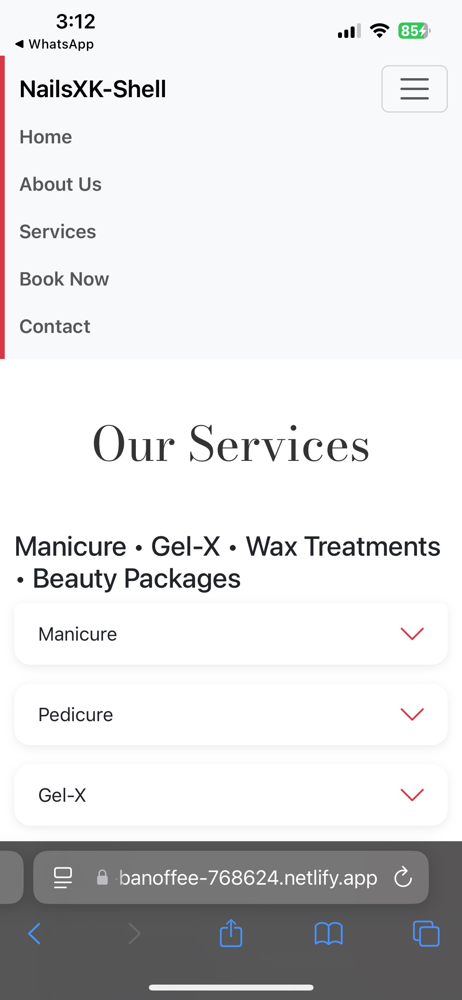

# NailsXK-Shell Website
# NailsXK-Shell Website
The NailsXK-Shell website uses jsDelivr as its CDN provider, serving Bootstrap 5.3.8 CSS and JavaScript with SRI integrity checks for secure, fast, global delivery. It relies on Bootstrap 5 for responsive layout and UI components, Google Fonts for Bodoni Moda and Luxurious Script typography, and vanilla JavaScript for lightweight form handling—no heavy frameworks. Performance testing shows a script evaluation time of 13.4 ms with CDN versus 14.0 ms without, confirming marginally faster rendering via CDN while maintaining sub-1.5-second load times. For accessibility, the site uses semantic HTML, descriptive alt text, keyboard navigation, and sufficient color contrast; for SEO, it includes unique page titles, meta descriptions with local keywords (“Trinidad & Tobago”, “TTD”), mobile responsiveness, and fast loading—optimized for local discovery and user experience.

## Deployment Confirmation

## Live Homepage

## Live About Page

## Live Services Page

## Live Booking Page

## Live Contact Us Page

## Live Thank you Page

## Netlify
.png)
.png)

## Live Mobile Homepage
 

## Live Mobile About Page

## Live Mobile Booking Page

## Live Mobile Services Page

## Live Mobile Contact Page

## Live Mobile Thank You Page

## Live Mobile NavBar

## Website's own Domain & Deployed Link
https://dash.infinityfree.com/accounts/if0_40537311/domains/nailsxk-shell.infinityfree.me ,
https://zingy-banoffee-768624.netlify.app/

